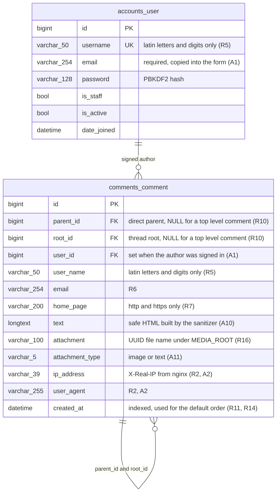

# Comments SPA

A single page comment system with cascading replies: a table of top level comments with
sorting and pagination, threads of any depth, limited HTML formatting with a live preview,
image and text attachments, CAPTCHA, real time updates over WebSocket and optional JWT
accounts.

Test assignment for dZENcode (Junior+ level). The full requirements are numbered `R…`
(functional), `T…` (technologies), `D…` (delivery) and `A…` (assumptions); those identifiers
are used throughout the code and this file.

- **Live demo:** http://158.101.193.255
- **Video walkthrough:** https://drive.google.com/file/d/1JmMrrhBFvM1BwpCrPb4pO6b3AVhw51uw/view?usp=sharing

---

## Features

| | Feature | Requirements |
|---|---|---|
| 📋 | Top level comments in a table, 25 per page, newest first | R11, R12, R14 |
| ↕️ | Sorting by user name, e-mail and date, both directions | R11 |
| 🧵 | Threads of any depth, chronological inside a thread | R10, A5 |
| ✍️ | Comment form: name, e-mail, home page, message, CAPTCHA | R5–R9 |
| 🔤 | Only `<a>`, `<code>`, `<i>`, `<strong>` are allowed; tag nesting is verified | R19, R20 |
| 👀 | Preview rendered by the same sanitizer that stores the comment | R22, A29 |
| 🔘 | Toolbar buttons `[i] [strong] [code] [a]` wrap the selected text | R23 |
| 🖼️ | Image attachments (JPG/GIF/PNG) resized to 320×240, TXT up to 100 KB | R16–R18 |
| 🔍 | Attachments open in a modal window with animation | R18a, R24 |
| ⚡ | New comments appear in every open tab without a reload | T6, A16 |
| 🔐 | Registration, login and JWT session; the account fills in name and e-mail | T10, A1 |
| 📨 | The author of a parent comment is notified by e-mail in the background | T7, A17 |
| 🗄️ | List pages are cached in Redis and invalidated on every new comment | T8, A18 |
| 🛡️ | Protection from XSS and SQL injection, verified by tests | R13 |

---

## Stack

**Backend:** Python 3.14 · Django 5.2 LTS · Django REST Framework · PostgreSQL 17 ·
Redis 7 · Django Channels + Daphne (ASGI) · Celery · Simple JWT · django-simple-captcha ·
Pillow
**Frontend:** Vue 3.5 (Composition API, `<script setup>`) · Vite · plain JavaScript ·
no Vue Router, no Pinia, no UI kit
**Infrastructure:** Docker, Docker Compose, nginx

The HTML sanitizer, the CAPTCHA challenge generator and the lightbox are written from
scratch — see [Assumptions](#assumptions).

---

## Architecture

```
Browser (Vue SPA) ── HTTP / WS ──► nginx :80
                                     ├─ /                        → built SPA
                                     ├─ /media/, /static/        → shared volumes
                                     ├─ /api/, /admin/, /captcha/ → daphne:8000
                                     └─ /ws/                     → daphne:8000 (upgrade)

daphne (Django ASGI: DRF + Channels) ──► PostgreSQL
                                     └─► Redis (cache 0, Celery broker 1, channel layer 2)
celery worker ──► Redis + PostgreSQL + e-mail
```

What happens when a comment is created:

1. `POST /api/comments/` → CAPTCHA is checked and burned, fields are validated, the message
   is rebuilt into safe HTML, the attachment is verified by content and resized.
2. The comment is saved; the model fills in the thread root.
3. After the transaction commits, a `post_save` signal fires three reactions: the list cache
   version is bumped, the comment is broadcast over WebSocket, and a notification task is
   queued.

---

## Quick start with Docker

```bash
git clone <repository-url>
cd django-vue-comments
cp .env.example .env
docker compose up --build
```

The application is available at **http://localhost**. To use the admin site, create a
superuser:

```bash
docker compose exec backend python manage.py createsuperuser
# http://localhost/admin/
```

Useful commands:

```bash
docker compose logs -f backend worker   # logs, including the notification e-mails
docker compose exec backend pytest      # backend tests inside the container
docker compose down                     # stop; add -v to drop the database as well
```

---

## Local development without Docker

**Backend** (PostgreSQL and Redis still come from Docker):

```bash
docker compose up -d db redis
cd backend
python -m venv .venv && source .venv/bin/activate   # Windows: .venv\Scripts\activate
pip install -r requirements-dev.txt
python manage.py migrate
python manage.py runserver        # http://localhost:8000
celery -A config worker -l info   # in another terminal; on Windows add --pool=solo
```

Set `POSTGRES_HOST=localhost` and `REDIS_URL=redis://localhost:6379` in `.env` for this mode.

**Frontend:**

```bash
cd frontend
npm ci
npm run dev        # http://localhost:5173, proxies /api, /captcha, /media and /ws to :8000
```

> While developing with `npm run dev`, set `DJANGO_DEBUG=True` so that Django serves
> `/media/` through the Vite proxy — in production those files are served by nginx.

---

## Environment variables

Everything lives in `.env` (see `.env.example`); nothing is hard-coded.

| Variable | Default | Meaning |
|---|---|---|
| `DJANGO_SECRET_KEY` | insecure example | Secret used for signing. **Generate your own for production.** |
| `DJANGO_DEBUG` | `False` | Debug mode. `True` only for local development. |
| `DJANGO_ALLOWED_HOSTS` | `localhost,127.0.0.1` | Comma separated host names the app answers to. |
| `DJANGO_CSRF_TRUSTED_ORIGINS` | `http://localhost` | Origins allowed to submit admin forms. |
| `DJANGO_HTTPS` | `False` | Turns on the https redirect, secure cookies and HSTS. |
| `POSTGRES_DB` / `POSTGRES_USER` / `POSTGRES_PASSWORD` | `comments` | Database credentials. |
| `POSTGRES_HOST` / `POSTGRES_PORT` | `localhost` / `5432` | Compose overrides the host with `db`. |
| `REDIS_URL` | `redis://localhost:6379` | Cache (db 0), Celery broker (db 1), channel layer (db 2). |
| `DEFAULT_FROM_EMAIL` | `comments@example.com` | Sender of notification e-mails. |
| `EMAIL_BACKEND` | console | Notifications are printed to the worker log until SMTP is configured. |
| `EMAIL_HOST` / `EMAIL_PORT` / `EMAIL_HOST_USER` / `EMAIL_HOST_PASSWORD` / `EMAIL_USE_TLS` | empty / `587` / … | SMTP settings. |

---

## API

All endpoints live under `/api/`. Validation errors follow the DRF format —
`{"field": ["message", …]}` with status `400`.

| Method and path | Purpose |
|---|---|
| `GET /api/comments/?ordering=<field>&page=<n>` | Top level comments, 25 per page. `ordering` ∈ `user_name`, `-user_name`, `email`, `-email`, `created_at`, `-created_at`; default `-created_at`. Each row carries `replies_count`. |
| `POST /api/comments/` | Create a comment or a reply. `multipart/form-data`: `user_name`, `email`, `home_page`, `text`, `captcha_key`, `captcha_value`, `attachment`, `parent`. |
| `GET /api/comments/<id>/thread/` | A top level comment with the whole tree in `children`, oldest first. `404` for a reply. |
| `POST /api/comments/preview/` | `{"text": "…"}` → `{"html": "…"}`, or validation errors. |
| `GET /api/captcha/` | A new challenge: `{"key": "…", "image_url": "…"}`. |
| `POST /api/auth/register/` | Create an account. |
| `POST /api/auth/token/` · `POST /api/auth/token/refresh/` | Obtain and refresh JWT. |
| `GET /api/auth/me/` | The current user; requires `Authorization: Bearer <access>`. |

A signed in visitor does not send `user_name` and `email`: the server takes them from the
account and ignores whatever arrives in the request (A1). CAPTCHA is required for everybody.

### WebSocket

`ws://<host>/ws/comments/` — one group for all visitors, server to client only. Every new
comment arrives as:

```json
{
  "type": "comment.created",
  "comment": {
    "id": 42, "parent": 7, "root": 7,
    "user_name": "Anonym", "email": "anonym@example.com", "home_page": "",
    "text": "<strong>safe</strong> html", "attachment": null, "attachment_type": "",
    "created_at": "2026-09-24T18:30:00Z"
  }
}
```

Messages sent by a client are ignored: comments are created only through the REST API, where
all the validation lives. The connection is checked against `ALLOWED_HOSTS` by its `Origin`
header, and the client reconnects on its own with a growing delay.

---

## Tests and linters

```bash
# backend: 273 tests
cd backend && pytest -q
ruff check . && ruff format --check .

# frontend: 165 tests
cd frontend && npm run test:unit -- --run
npm run lint
```

The suites cover the HTML sanitizer (every allowed and forbidden case, escaping and
idempotence), attachments, CAPTCHA, the whole API including XSS and SQL injection strings,
the cache, events and the queue, WebSocket, JWT, and the frontend: validators, the table,
threads, the form and the lightbox.

---

## Database schema



The tree lives in two self references: `parent_id` drives indentation and ordering inside a
thread, `root_id` lets a whole thread of any depth be fetched with one indexed query.
Deleting a top level comment cascades to its thread; deleting an account only detaches the
comment (`ON DELETE SET NULL`) — the text and the signature stay.

Indexes: `created_at`, `user_name`, `email` for the table sorting (R11, R14), plus the
automatic indexes of the three foreign keys. A database level `CHECK` keeps `attachment`
and `attachment_type` filled in together or not at all (A11).

Files:

- `docs/db/schema.mysql.sql` — the same application tables in MySQL dialect, ready for
  **MySQL Workbench** (File → Import → Reverse Engineer MySQL Create Script). The import
  instructions are at the top of the file.
- `docs/db/schema.mwb`, `docs/db/schema.png` — the model and the ER diagram exported from
  Workbench.

The application itself runs on PostgreSQL (A21); the MySQL file exists so that the designed
schema can be compared with the implemented one. Django's service tables
(`django_migrations`, `django_session`, `auth_permission`, `captcha_captchastore`, …) are
created by framework migrations and are left out of both the diagram and the file.

---

## Deployment

Step by step instructions for a fresh VDS — installing Docker, cloning, `.env`, first run,
updates and optional HTTPS — are in [`docs/DEPLOY.md`](docs/DEPLOY.md).

---

## Assumptions

The assignment leaves a few things open; the decisions below are recorded as `A…` and used
consistently in the code.

- **Anyone may comment** (A1). JWT adds optional accounts: after signing in, the name and
  e-mail come from the account and the comment is linked to the user. CAPTCHA is required
  for everybody.
- **Forbidden markup is rejected**, not stripped (A8): the error message names the tag or
  the attribute. The server rebuilds the message from escaped text and normalised tags, and
  exactly that string is stored (A10).
- **One attachment per comment** — an image or a TXT file (A11). The format is detected by
  content, not by extension; an animated GIF becomes a still first frame after resizing (A12).
- **The tree** is stored as `parent` + `root`, without MPTT: a whole thread is one indexed
  query (§3.4).
- **Pagination applies to top level comments only**; a thread is always loaded in full (A4).
- **Tokens live in `localStorage`** (A20) — a deliberate trade-off against `httpOnly`
  cookies: simpler and free of CSRF, but readable by a successful XSS. Hence the strict
  sanitizer and a single `v-html` for one server-built field.
- **No rating, bookmarks, quotes or comment editing** — they appear in the mock-up but not
  in the requirements (A6).
- **Moderation** is done through the Django admin (A27).

---

## Licence

MIT — see [LICENSE](LICENSE).
